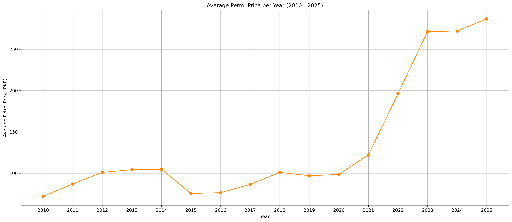
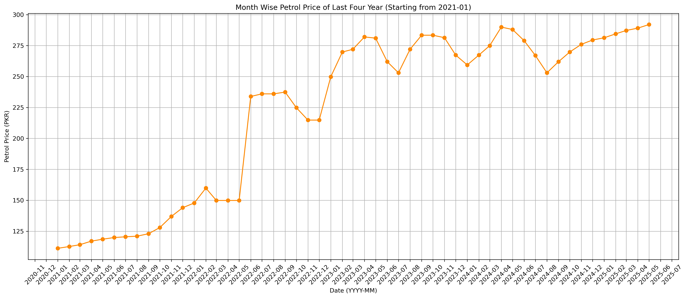

# ⛽ Pakistan Petrol Price Prediction (2026–2035)

This project focuses on analyzing and predicting petrol prices in Pakistan using historical monthly data from **2010 to 2025**. Various regression models were trained to forecast petrol prices for the years **2026–2035**.

## 📊 Dataset Overview

- **Rows**: 185  
- **Columns**: `Date`, `Petrol Price (PKR per litre)`  
- No missing or duplicate values

### Data Transformations:
- Converted `Date` to datetime format
- Extracted `Year` and `Month` from `Date` column

---

## 📈 Exploratory Data Analysis (EDA)

1. **Average Petrol Price per Year**  
   A line plot was created showing a steady increase in average petrol prices from 2010 to 2025.

2. **Month-wise Petrol Price (2021–2025)**  
   A detailed monthly price trend plot showed the rising cost in recent years, especially after 2022.

---

## 🤖 Models Trained

The models were trained using `Year` and `Month` as input features:

| Model               | R² Score  |
|---------------------|-----------|
| Gradient Boosting   | 0.9898    |
| Random Forest       | 0.9872    |
| XGBoost             | 0.9550    |
| KNN                 | 0.9512    |
| Lasso Regression    | 0.5304    |
| Ridge Regression    | 0.5304    |
| Linear Regression   | 0.5303    |

---

## 🔮 Future Price Predictions (2026–2035)

### Gradient Boosting (Best Performer)
Predicted the same value (≈ 280.30 PKR) for every year, due to the model's nature of not extrapolating beyond training data.

### Other Model Insights

- **Random Forest**: Predicted constant price ≈ 280.71 PKR for all years.
- **XGBoost**: Predicted constant price ≈ 281.30 PKR for all years.
- **KNN**: Slightly varied predictions due to averaging neighbors.
- **Linear Models (Lasso, Ridge, Linear Regression)**:  
  Predicted linearly increasing prices (e.g., 233 → 343 PKR) due to their extrapolation capabilities.

---

## 📌 Model Behavior Summary

| Model Type         | Behavior on Future Data      |
|--------------------|------------------------------|
| Tree-Based         | High accuracy, flat outputs  |
| KNN                | Slight variation             |
| Linear Models      | Linear extrapolation, lower R² |

### Key Insight:
> **Tree-based models are highly accurate on known data but struggle with extrapolation. Linear models extrapolate better but may underfit.**

---

## 📷 Visuals

---

## 🧠 Tools & Libraries

- Python (Pandas, NumPy, Matplotlib)
- Scikit-learn
- XGBoost
- GradientBoosting, RandomForest, KNN, Lasso, Ridge, Linear Regression

---

## ✅ Conclusion

This analysis provides a strong foundation for understanding petrol price trends in Pakistan. It highlights how different models behave when forecasting beyond training data and stresses the importance of selecting the right approach for time-based regression problems.
